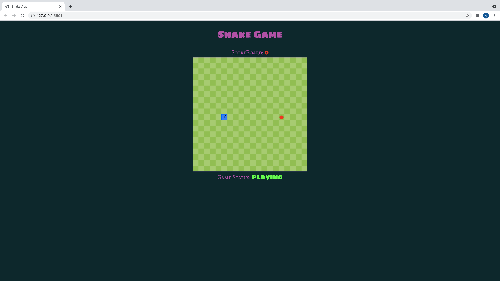

# Snake Game

*A fun and interactive snake application written in pure HTML, CSS, and vanilla JavaScript*

Check it out <a href="https://andrew-k191.github.io/snake-game/">here!!!</a>

## Summary

Woohoo! Another project complete! Like the previous project I completed (calculator app), I have a newfound appreciation for how such a seemingly simple game can be so challenging to implement. This was my first game project and exposure to the HTML Canvas API. As a result, I encountered many difficulties understanding how to implement the game logic for this project. Some of the issues I encountered involved generating animations, drawing shapes, and linking the animations to event listeners. Although I encountered many of these and other instances of failure/troubleshooting my prior experience with other projects really helped me through. That gave me the confidence and understanding to keep moving forward towards completion. My proficiency reading documentation (specifically MDN docs and StackOverflow posts) and writing cleaner code were some improvements I think I have made. Overall this project was really fun and I hope to implement some additional features in the future.

A few of these would be:
* pause/play feature
* improved snake graphics/appearance
* sound effects

## Author

* **Andrew Knight** - *Software Developer* - (Website)|(LinkeIn)
